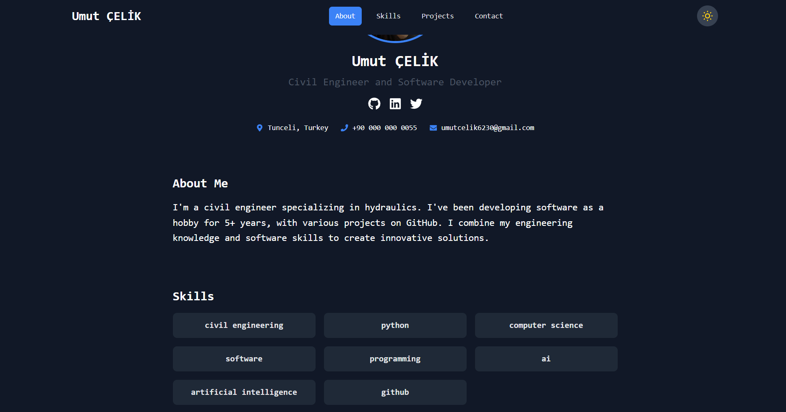
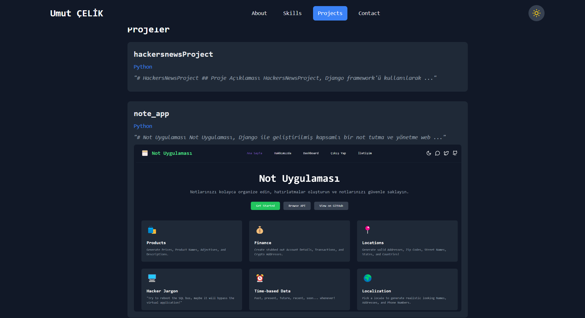
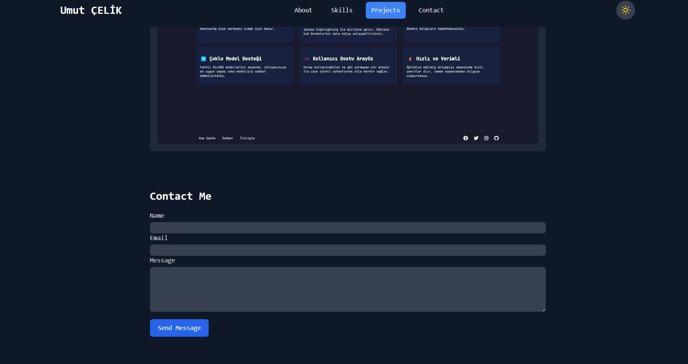

# Modern Portföyo Web Sitesi





# Modern Portföyo Web Sitesi

Bu proje, Next.js, TypeScript, Tailwind CSS ve MongoDB kullanılarak oluşturulmuş dinamik bir portföyo web sitesidir.

## Özellikler

- Responsive tasarım
- Karanlık/Aydınlık mod
- Dinamik içerik yönetimi
- GitHub entegrasyonu
- İletişim formu
- Admin paneli
- MongoDB ile veri yönetimi

## Kurulum

1. Repoyu klonlayın:
   ```
   git clone https://github.com/kullaniciadi/portfolio.git
   ```

2. Bağımlılıkları yükleyin:
   ```
   cd portfolio
   npm install
   ```

3. `.env.local` dosyası oluşturun ve gerekli ortam değişkenlerini ekleyin:
   ```
   MONGODB_URI=your_mongodb_connection_string
   GITHUB_TOKEN=your_github_personal_access_token
   GITHUB_USERNAME=your_github_username
   EMAIL_HOST=your_email_host
   EMAIL_PORT=your_email_port
   EMAIL_HOST_USER=your_email
   EMAIL_HOST_PASSWORD=your_email_password
   ```

4. Geliştirme sunucusunu başlatın:
   ```
   npm run dev
   ```

5. Tarayıcınızda `http://localhost:3000` adresine gidin.

## MongoDB İşlemleri

### Bağlantı Kurma

MongoDB bağlantısı için `lib/mongodb.ts` dosyasını kullanın:

```typescript:lib/mongodb.ts
import { MongoClient } from 'mongodb';

const uri = process.env.MONGODB_URI;
const options = {};

let client;
let clientPromise: Promise<MongoClient>;

if (!process.env.MONGODB_URI) {
  throw new Error('MONGODB_URI ortam değişkeni tanımlanmamış');
}

if (process.env.NODE_ENV === 'development') {
  if (!global._mongoClientPromise) {
    client = new MongoClient(uri, options);
    global._mongoClientPromise = client.connect();
  }
  clientPromise = global._mongoClientPromise;
} else {
  client = new MongoClient(uri, options);
  clientPromise = client.connect();
}

export default clientPromise;
```

### Veri Ekleme

```typescript
import clientPromise from '../lib/mongodb';

async function addData(collection: string, data: any) {
  const client = await clientPromise;
  const db = client.db('your_database_name');
  const result = await db.collection(collection).insertOne(data);
  return result;
}
```

### Veri Okuma

```typescript
import clientPromise from '../lib/mongodb';

async function getData(collection: string, query: any = {}) {
  const client = await clientPromise;
  const db = client.db('your_database_name');
  const result = await db.collection(collection).find(query).toArray();
  return result;
}
```

### Veri Güncelleme

```typescript
import clientPromise from '../lib/mongodb';

async function updateData(collection: string, filter: any, update: any) {
  const client = await clientPromise;
  const db = client.db('your_database_name');
  const result = await db.collection(collection).updateOne(filter, { $set: update });
  return result;
}
```

### Veri Silme

```typescript
import clientPromise from '../lib/mongodb';

async function deleteData(collection: string, filter: any) {
  const client = await clientPromise;
  const db = client.db('your_database_name');
  const result = await db.collection(collection).deleteOne(filter);
  return result;
}
```

## Kullanım

- Ana sayfa: Portföyo içeriğinizi görüntüleyin.
- Admin paneli: `/admin/update` sayfasından içeriğinizi güncelleyin.

## Dağıtım

Projeyi Vercel veya benzeri bir platformda dağıtabilirsiniz. Dağıtım öncesinde `.env` değişkenlerini platform üzerinde ayarlamayı unutmayın.

## Katkıda Bulunma

1. Bu repoyu fork edin
2. Yeni bir özellik dalı oluşturun (`git checkout -b feature/AmazingFeature`)
3. Değişikliklerinizi commit edin (`git commit -m 'Add some AmazingFeature'`)
4. Dalınıza push yapın (`git push origin feature/AmazingFeature`)
5. Bir Pull Request oluşturun

## Lisans

Bu proje MIT lisansı altında lisanslanmıştır. Detaylar için `LICENSE` dosyasına bakın.
